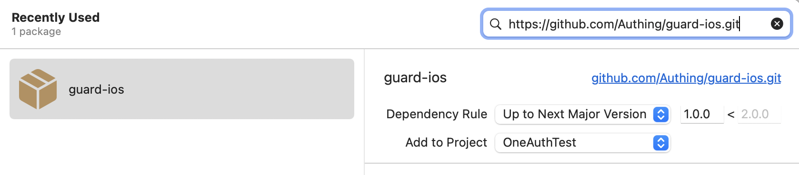

# Authing Guard

Authing guard is a UI component library for identity applications. It provides semanticalized hyper components for fast integration with Authing IDaaS service.

<br>

## Quick Start

1. add Swift Package

https://github.com/Authing/guard-ios



2. Start guard during application launch (e.g. inside AppDelegate.swift):

```swift
Authing.start(appid: "your_authing_app_id");
```

3. When authentication is required, start auth flow via:

```swift
AuthFlow.start { userInfo in
    if (userInfo != nil) {
        // logged in
    } else {
        // handle error
    }
}
```

4. Add token (userInfo.token) to your resource request as Authorization header. e.g.

```swift
request.addValue("Bearer \(userInfo.token!)", forHTTPHeaderField: "Authorization")
```