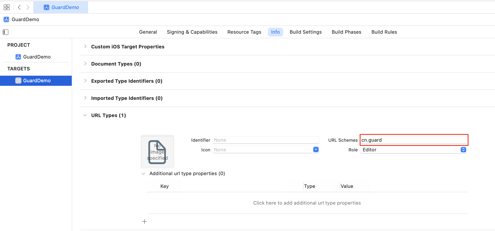

# 集成支付宝步骤

1. 通过 Swift Package Manager，添加依赖

https://github.com/Authing/guard-ios


2. 在应用的 Info.plist 里面设置回调 URL Scheme



3. 在应用启动的时候设置支付宝信息：

```swift
import Guard

Authing.setupAlipay("your_alipay_appid", customScheme: "cn.guard")
```

>第一个参数为支付宝应用 id；customScheme 和第 2 步填入 Info.plist 的值必须一致

4. 初始化 Authing：
```swift
//  参数为 authing 的应用 id，可以在 authing 控制台里面获取
Authing.start("your_authing_appid");
```
5. 支付宝返回应用后，如果使用了 SceneDelegate，则需要在 SceneDelegate.swift 里面重载下面的函数：

```swift
func scene(_ scene: UIScene, openURLContexts URLContexts: Set<UIOpenURLContext>) {
    NotificationCenter.default.post(name: NSNotification.Name(rawValue: "alipayLoginOK"), object: URLContexts.first?.url)
}
```

如果未使用 SceneDelegate，则需要在 AppDelegate 里面重载

```swift
func application(_ app: UIApplication, open url: URL, options: [UIApplication.OpenURLOptionsKey : Any] = [:]) -> Bool {
    NotificationCenter.default.post(name: NSNotification.Name(rawValue: "alipayLoginOK"), object: URLContexts.first?.url)
    return true
}
```

6. 如果使用我们提供的语义化的认证流程，则只需要在 xib 里面放置一个）：

```swift
AlipayButton
```

所有的逻辑由我们语义化引擎自动处理

如果不想使用我们内置的按钮，则可以在自己按钮的点击事件里面调用：

```swift
let alipay: Alipay = Alipay()
alipay.login { code, message, userInfo in
    if (code == 200) {
        // logged in
    } else {
        // handle error
    }
}
```

>注意：alipay 对象不能是局部变量，需要保存为控件的成员变量