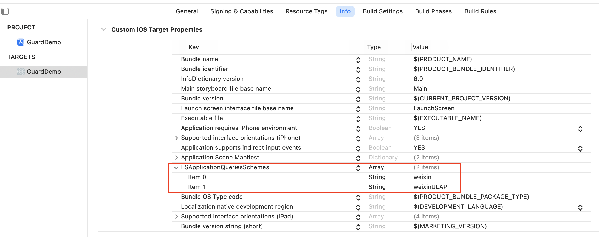

# 集成微信步骤

1. 通过 Swift Package Manager，添加依赖

https://github.com/Authing/guard-ios


2. Info.plist 里面添加启动微信白名单

key：LSApplicationQueriesSchemes

value：weixin，weixinULAPI

> 注意 value 是大小写敏感的



3. 在应用启动的时候设置微信：

```swift
import Guard

Authing.setupWechat("your_wechat_appid", universalLink: "your_deep_link")
 ```

>第一个参数为微信应用 id；第二个参数为 iOS [Universal Link](https://developer.apple.com/ios/universal-links/)

4. 初始化 Authing：
```swift
//  参数为 authing 的应用 id，可以在 authing 控制台里面获取
Authing.start("your_authing_appid");
```
5. 微信返回应用后，如果使用了 SceneDelegate，则需要在 SceneDelegate.swift 里面重载下面的函数：

```swift
func scene(_ scene: UIScene, continue userActivity: NSUserActivity) {
    NotificationCenter.default.post(name: NSNotification.Name(rawValue: "wechatLoginOK"), object: userActivity)
}
```

如果未使用 SceneDelegate，则需要在 AppDelegate 里面重载

```swift
func application(_ application: UIApplication, continue userActivity: NSUserActivity, restorationHandler: @escaping ([UIUserActivityRestoring]?) -> Void) -> Bool {
    NotificationCenter.default.post(name: NSNotification.Name(rawValue: "wechatLoginOK"), object: userActivity)
    return true
}
```

6. 通过我们提供的语义化 Hyper Component，只需要在 xib 里面放置一个：

```swift
WechatLoginButton
```

所有的逻辑由我们语义化引擎自动处理
