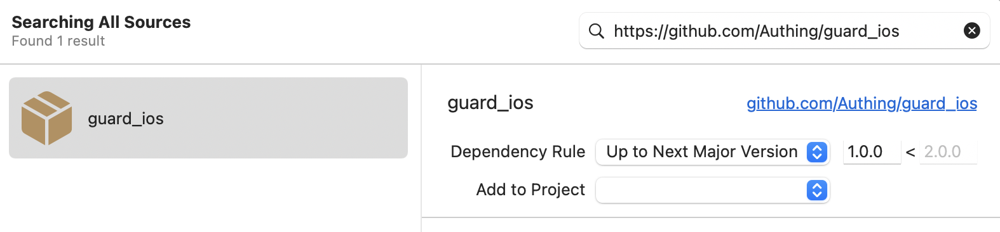
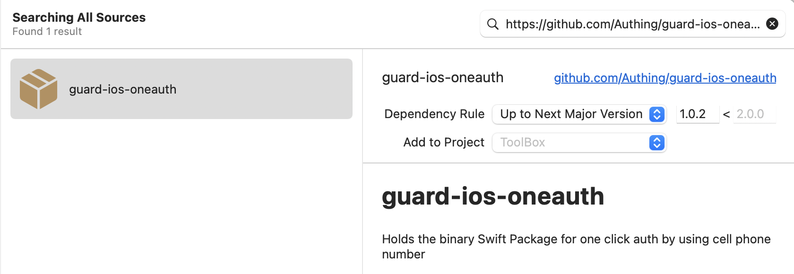

# 接入步骤

> 注意：iOS 仍在 beta 版本。功能可以用，但样式以及 API 接口还在完善中

1. 通过 Swift Package Manager，添加 2 个依赖

https://github.com/Authing/guard-ios



https://github.com/Authing/guard-ios-oneauth



2. 在应用启动（如 AppDelegate）里面初始化 Authing：

```swift
Authing.start("your_authing_app_id");
```

3. 发起认证

* 若使用 Authing 自带 UI 风格：

```swift
import Guard
import OneAuth

// self is current view controller
OneAuth.start(self, businessId: "your_yidun_businessId") { code, message, userInfo in
    DispatchQueue.main.async() {
        if (code == 200 && userInfo != nil) {
            // logged in
        } else {
            // handle error
        }
    }
}
```

* 若需要自定义 UI 风格，首先参考 [易盾 iOS 开发文档](https://github.com/yidun/NTESQuickPass/blob/master/doc/%E4%B8%80%E9%94%AE%E7%99%BB%E5%BD%95iOS%20SDK%E6%8E%A5%E5%85%A5%E6%8C%87%E5%8D%97.md)，生成 NTESQuickLoginModel，然后按下面方式调用（注意多传一个 model 参数）

```swift
import Guard
import OneAuth

// self is current view controller
let model: NTESQuickLoginModel = NTESQuickLoginModel()
OneAuth.start(self, businessId: "your_yidun_businessId", model: model) { code, message, userInfo in
    DispatchQueue.main.async() {
        if (code == 200 && userInfo != nil) {
            // logged in
        } else {
            // handle error
        }
    }
}
```